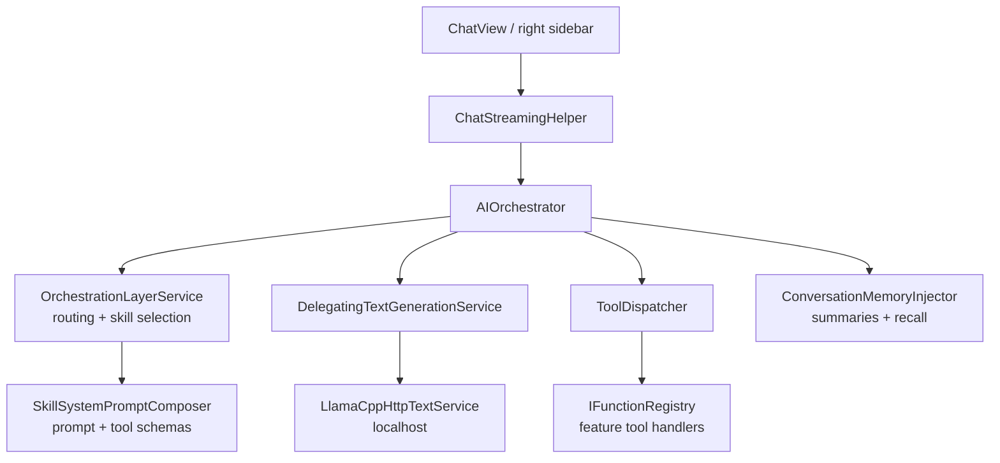

The AI subsystem is shipped but experimental. It is fully local by default, off by default, and gated behind one setting. This page is the map; [RAG](/docs/developers/ai/rag) and [Skills and tools](/docs/developers/ai/skills-tools) go deeper.

## The stack

Inference runs through llama.cpp server processes, not in-process bindings. `LlamaCppServerManager` spawns `llama-server.exe` per model role and `LlamaCppHttpTextService` talks to it over the local OpenAI-compatible HTTP API. Processes start on the first generation request, never at app boot, and `ResourceGovernor` serializes model use and unloads idle models after the `AI.UnloadTimeout`.

Models live under `%LocalAppData%\mnemo\models\` (lowercase root), scanned by `ModelRegistry`:

| Role | Folder | Port | Purpose |
| :--- | :--- | :--- | :--- |
| Manager | `text/manager` | 8000 | Routing, skill classification, conversation summaries |
| Low | `text/low` | 8001 | Fast chat, vision when an `mmproj` is present |
| Mid | `text/mid` | 8002 | Reasoning tier |
| High | `text/high` | 8003 | Reasoning tier for strong hardware |
| Embedding | `embedding/bge-small` | none | ONNX, see RAG |
| STT | `audio/STT` | none | Whisper tiny model for dictation |

`AIModelsSetupService` downloads model zips from the project's GitHub releases; `HardwareDetector` and `HardwareTierEvaluator` pick a recommended tier. GPU use is a setting (`AI.GpuAcceleration`).

There are no OpenAI, Anthropic, or Ollama clients in the codebase, and no API key surface. The one cloud path is the developer-only Vertex Gemini "teacher" client used for dataset work, gated behind hidden developer settings plus explicit credentials.

## A chat turn

The manager model (or the teacher, for developers) classifies each message and picks which skills to inject. The main model then streams, possibly emitting tool calls; `ToolDispatcher` executes them and feeds results back, up to eight rounds. Conversation memory summarizes every three turns and adds vector recall for long chats.

## Gating

Everything hangs off `AI.EnableAssistant`, default false. The setting controls the Chat and Learning Path sidebar entries, navigation gating of those routes, the right-sidebar assistant, and lazy loading of tools and skill manifests through `AiAssistantToolHost`. Disabling the assistant unloads tools and redirects away from AI routes.

## Functional versus stubbed

Verified against the code; useful before promising anything:

| Capability | Status |
| :--- | :--- |
| Local streaming chat with tools | works |
| Learning path generation | works |
| Whisper dictation | works once the STT model is installed |
| Vision attachments | works with the optional image model variants |
| Conversation memory | works |
| Chat file attachments feeding RAG | not wired; files attach in UI but are not ingested |
| `create_learning_path` AI tool | disabled in its manifest |
| Flashcard generation, OCR, note summarization | do not exist |
| `AIOrchestrator.GetRagContextAsync` | dead code, never called |

## Privacy

User content, chat history, embeddings, and inference all stay on the machine. Network traffic from the AI stack is limited to model downloads from GitHub. Opt-in developer features (teacher model, dataset logging) are the only exceptions and are off by default.

## Where the code lives

| Concern | Path |
| :--- | :--- |
| Orchestration | `Mnemo.Infrastructure/Services/AI/` (`AIOrchestrator`, `OrchestrationLayerService`, `ToolDispatcher`) |
| Inference | `LlamaCppServerManager.cs`, `LlamaCppHttpTextService.cs` (same folder) |
| Models and setup | `Mnemo.Infrastructure/Services/ModelRegistry.cs`, `AIModelsSetupService.cs` |
| Chat UI | `Mnemo.UI/Modules/Chat/`, `Mnemo.UI/Components/RightSidebar/`, `Mnemo.UI/Services/ChatStreamingHelper.cs` |
| Gating | `Mnemo.UI/Services/AiAssistantToolHost.cs`, `Mnemo.UI/Services/NavigationService.cs` |
| Training tooling (not shipped) | `training/`, `docs/datasets/` in the main repo |
