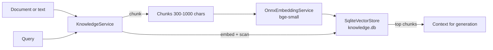

The knowledge subsystem gives the AI features semantic retrieval over locally ingested text. It is intentionally simple: ONNX embeddings, a single SQLite table of vectors, and brute-force cosine search. Like the rest of the AI stack, it is experimental.

## Components

**`KnowledgeService`** (`Mnemo.Infrastructure/Services/Knowledge/`) is the facade: ingest, chunk, embed, search. Chunking normalizes whitespace (PDF line breaks, hyphenation), splits on paragraphs, merges small pieces and sentence-splits large ones into chunks of roughly 300 to 1000 characters. PDF text extraction uses PdfPig; scanned PDFs without a text layer yield nothing.

**`OnnxEmbeddingService`** runs the `bge-small` model through ONNX Runtime on CPU, with an in-process WordPiece tokenizer (max sequence 512, batches of 24), producing L2-normalized vectors.

**`SqliteVectorStore`** stores chunks in `knowledge.db`, one row per chunk: content, source ID, scope ID, JSON metadata, and the embedding as a float32 blob. Search embeds the query and scans the full table computing dot products. There is no vector index extension; this is fine at current scales and trivially debuggable, but it is linear in corpus size.

**Scopes** partition the store. Learning paths ingest into a per-path scope, conversation memory into `conv_mem_{conversationId}`. Search is scoped, so one path's materials never leak into another's generation.

## What is actually indexed

This is where expectations and code diverge most, so be precise:

| Source | Indexed? |
| :--- | :--- |
| Learning path file uploads | Yes, at path creation, when `AI.EnableRAG` is on |
| Long conversation memory | Yes, summaries embedded after enough turns |
| Notes | No automatic indexing on save or edit |
| Chat file attachments | No; the UI accepts files but never calls ingestion |

Consequences worth knowing: the notes AI tool's semantic mode searches the global knowledge base, not notes, so it can return chunks that do not correspond to any note (the tool description says as much). And `AIOrchestrator.GetRagContextAsync`, which would inject retrieval into the main chat loop, exists but has no callers. The `AI.EnableRAG` setting therefore affects path generation and the semantic tool, not live chat.

## Retrieval consumers

1. **Learning path generation**: `GeneratePathTask` and `GenerateUnitTask` search the path's scope and pass top chunks into schema-constrained generation.
2. **Conversation memory**: `ConversationMemoryInjector` recalls semantically relevant summaries in long chats.
3. **Notes tool semantic mode**: global-scope search exposed to the assistant.

## Where the code lives

| Concern | Path |
| :--- | :--- |
| Facade | `Mnemo.Infrastructure/Services/Knowledge/KnowledgeService.cs` |
| Embeddings | `Mnemo.Infrastructure/Services/Knowledge/OnnxEmbeddingService.cs` |
| Vector store | `Mnemo.Infrastructure/Services/Knowledge/SqliteVectorStore.cs` |
| Path ingestion | `Mnemo.UI/Modules/Path/` (`GeneratePathTask`, `GenerateUnitTask`) |
| Memory | `ConversationSummarizer`, `ConversationMemoryInjector`, `ConversationLongTermMemoryEmbedder` in `Mnemo.Infrastructure/Services/AI/` |
