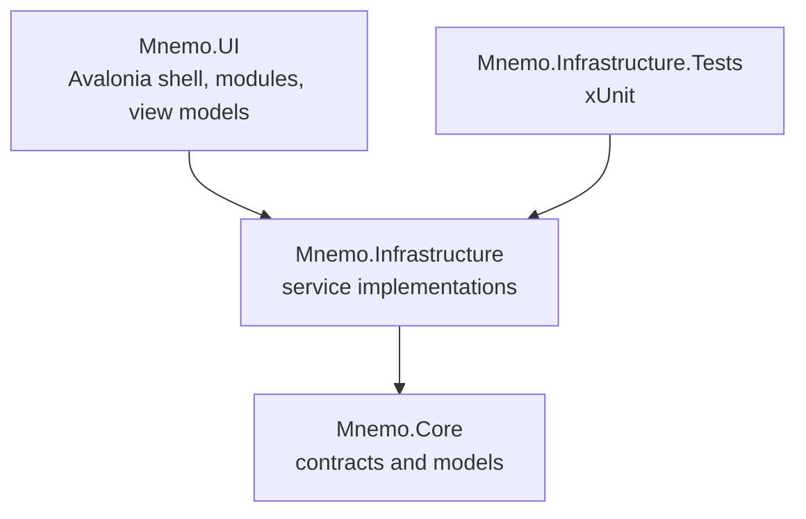

Mnemo is a modular MVVM desktop app. One solution, `MnemoApp.sln`, with four projects and a strict dependency direction.

## The layers

| Project | Role | May reference |
| :--- | :--- | :--- |
| `Mnemo.Core` | Interfaces, domain models, enums, and a few pure engines (sketch compiler, history contracts). No UI, no database, no AI packages. Only dependency is `CommunityToolkit.Mvvm`. | Nothing |
| `Mnemo.Infrastructure` | Implementations: SQLite storage, AI orchestration, flashcard scheduling, import/export, spellcheck, keybinds, statistics, updates. Heavy NuGet dependencies live here (Markdig, OnnxRuntime, Whisper.net, QuestPDF, Velopack, PdfPig, Hunspell). | Core |
| `Mnemo.UI` | The Avalonia application: windows, controls, feature modules, view models, themes, and the composition root. | Core, Infrastructure |
| `Mnemo.Infrastructure.Tests` | xUnit tests against Infrastructure. | Infrastructure |

The rule is simple: Core never references the other projects, and Infrastructure never references UI. Business logic that needs to stay testable gets an interface in Core and an implementation in Infrastructure. UI consumes the interface.

One nuance: a few engines live in Core directly rather than behind interfaces, because they are pure functions over data. The sketch compiler (`Mnemo.Core/Sketch/`) is the main example. The LaTeX engine is split: parsing in Infrastructure, layout and rendering in UI, since layout needs font measurement.

## The big picture at runtime

- **Composition root**: `Mnemo.UI/Services/Bootstrapper.cs` builds one `Microsoft.Extensions.DependencyInjection` container for the whole app. See [Startup flow](/docs/developers/architecture/startup-flow).
- **Modules**: each feature (Notes, Flashcards, Mindmap, Chat, ...) is an `IModule` discovered by reflection. Modules register their services, routes, sidebar items, translations, keybinds, AI tools, and widgets. See [Module system](/docs/developers/architecture/module-system).
- **Navigation**: view-model-first. A route string maps to a view model type; a convention-based `ViewLocator` finds the matching view. See [Navigation](/docs/developers/architecture/navigation).
- **State**: singleton services hold shared state, transient view models hold screen state, and the settings service doubles as the app-wide change-notification hub. See [State and history](/docs/developers/architecture/state-and-history).
- **Storage**: a single SQLite database used as a key-value store of JSON documents. See [Storage](/docs/developers/platform/storage).

## Repository layout

| Path | Contents |
| :--- | :--- |
| `Mnemo.Core/Models/` | Domain models grouped by feature (Flashcards, Mindmap, Keybinds, ...) |
| `Mnemo.Core/Services/` | The interface catalog, roughly 60 contracts |
| `Mnemo.Core/Sketch/` | Sketch diagram compiler |
| `Mnemo.Infrastructure/Services/` | Implementations, mirrored by feature folder |
| `Mnemo.Infrastructure/skills/` | AI skill manifests shipped with the app |
| `Mnemo.UI/Modules/` | Feature modules, one folder each |
| `Mnemo.UI/Components/` | Shared UI: shell chrome, the block editor, overlays |
| `Mnemo.UI/Services/` | Shell services, composition root, LaTeX layout |
| `Mnemo.UI/Themes/Core/` | The three built-in themes |
| `training/`, `docs/datasets/` | AI training tooling, not part of the shipped app |
