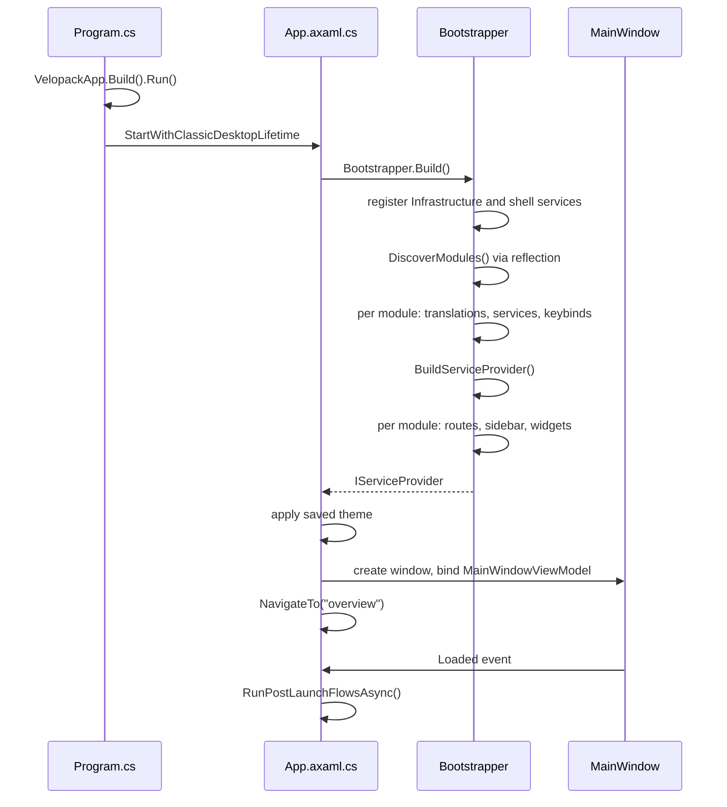

Startup is deliberately synchronous on the UI thread up to the point where the main window exists. Deferring the container build with `Task.Run` breaks the Avalonia desktop lifetime, so everything before the window is sequential, and slow work is pushed to background tasks instead.

## Phase by phase

**`Mnemo.UI/Program.cs`.** Two lines matter: `VelopackApp.Build().Run()` gives the updater its hook before anything else, then Avalonia starts with the classic desktop lifetime. There is no splash screen.

**`App.OnFrameworkInitializationCompleted` (`Mnemo.UI/App.axaml.cs`).** Builds the container via `Bootstrapper.Build()`, registers `ProcessExit` and `UnhandledException` handlers (mainly to kill spawned AI server processes), applies the saved theme, creates `MainWindow` with its view model from DI, wires `desktop.Exit` to dispose AI services and the provider, and navigates to the `overview` route.

**`Bootstrapper.Build()` (`Mnemo.UI/Services/Bootstrapper.cs`).** The only composition root. In order:

1. Registers Infrastructure and UI shell singletons directly on the `ServiceCollection` (storage, settings, AI stack, navigation, sidebar, overlays, toasts, registries).
2. `DiscoverModules()` scans loaded `Mnemo.*` assemblies for concrete `IModule` types and instantiates them with `Activator.CreateInstance`.
3. For each module, in this order: `RegisterTranslationSources`, `ConfigureServices`, `RegisterKeybindManifest`. These run before the provider exists, so modules only describe registrations here.
4. `BuildServiceProvider()`.
5. For each module: `RegisterRoutes`, `RegisterSidebarItems`, `RegisterTools`, `RegisterWidgets`. These run after the provider exists and may resolve real services.
6. Fires background tasks: the welcome-note first-run seed, GPU hardware detection, saved-language load, AI model registry refresh, and launch statistics.

**Post launch (`RunPostLaunchFlowsAsync`).** After `MainWindow.Loaded`: shows the onboarding overlay if onboarding has not completed, warns when installed AI models do not match the detected hardware tier, starts the update orchestrator, and shows a post-update toast when a new version just got applied.

## Ordering guarantees

The split around `BuildServiceProvider()` is the one rule to remember. Translation sources, service registrations, and keybind manifests must be known before the container builds. Routes, sidebar items, tools, and widgets come after, because registering them requires resolved services (widget factories, the navigation registry, the function registry).

There is no database migration step at startup. `SqliteStorageProvider` creates its tables lazily on first access and stamps a `DbVersion` of 1; no upgrade pipeline exists yet.

## Pitfalls

- Module discovery swallows constructor exceptions. A module that throws in its parameterless constructor silently never loads; nothing is logged.
- Anything registered outside `Bootstrapper` or a module will not exist. There is no second container.
- Background seed tasks are fire-and-forget. Do not add ordering dependencies on them.

## Where the code lives

| Concern | Path |
| :--- | :--- |
| Entry point | `Mnemo.UI/Program.cs` |
| App lifecycle | `Mnemo.UI/App.axaml.cs` |
| Composition root | `Mnemo.UI/Services/Bootstrapper.cs` |
| First-run seed | `Mnemo.Infrastructure/Services/Notes/WelcomeNoteFirstRunSeed.cs` |
| Update orchestration | `Mnemo.UI/Modules/Updates/Services/UpdateOrchestrator.cs` |
