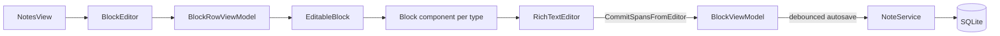

The note editor is a Notion-style block editor built from scratch on Avalonia. There is no web view and no third-party editor component. Understanding it means understanding three layers: the document model in Core, the block UI in `Mnemo.UI/Components/BlockEditor/`, and the custom rich text control that renders flow text.

## Document model

A note is an ordered list of `Block` records (`Mnemo.Core/Models/Blocks.cs`). Each block has an `Id`, a `BlockType`, an `Order`, optional `Children`, and two content carriers:

- **`Spans`**, a `List<InlineSpan>`, holds rich flow text. Three span kinds exist (`Mnemo.Core/Models/InlineSpan.cs`): `TextSpan` (text plus a `TextStyle`), `EquationSpan` (inline LaTeX), and `FractionSpan` (an inline numeric fraction). Equation and fraction spans are atomic: for caret movement and selection they count as one character, represented internally by sentinel characters (U+FFFC and U+FFF9).
- **`Payload`**, a typed record per non-flow block type (`Mnemo.Core/Models/BlockPayload.cs`): `EquationPayload`, `ImagePayload`, `CodePayload`, `ChecklistPayload`, `TwoColumnPayload`, `PagePayload` (a reference to an embedded note), and `SketchPayload`.

Block types: `Text`, `Heading1` to `Heading4`, `BulletList`, `NumberedList`, `Checklist`, `Quote`, `Code`, `Divider`, `Image`, `ColumnGroup`, `TwoColumn`, `Equation`, `Page`, `Sketch`.

Serialization is JSON through `BlockJsonConverter` (`Mnemo.Core/Serialization/`), which also migrates legacy shapes (`content` strings, `inlineRuns`) into the span model on read.

## Editing pipeline

`BlockEditor` (`BlockEditor.axaml.cs` plus roughly twenty partial classes: `History`, `Clipboard`, `Find`, `ImageDrop`, `BoxSelection`, `CrossBlockSelection`, ...) owns the block list. Each row hosts an `EditableBlock`, which wires keyboard handling, the slash menu (`SlashMenuCoordinator`), the formatting toolbar, and drag and drop, and selects a type-specific component via `BlockTypeToComponentConverter`.

Flow blocks render through `RichTextEditor`, a custom editable `Control` built on Avalonia's `TextLayout`. `RichTextLayoutBuilder` expands spans into layout text and maps logical caret positions to layout positions, reserving width for inline equations. Edits commit back as new span arrays through `BlockViewModel.CommitSpansFromEditor`.

Markdown-style triggers while typing (`#`, `-`, `>`, `---`, and so on) are detected by `MarkdownShortcutDetector` and convert the current block. Unicode replacements (`->` to an arrow, `\pi` to the symbol) come from the [text shortcut service](/docs/developers/editor/markdown#text-shortcuts).

## Clipboard

Copy and paste has a fidelity ladder (`BlockEditor.Clipboard.cs`):

1. **Mnemo JSON** (`NoteClipboardDocument`, `Mnemo.Core/Models/Clipboard/`): full fidelity, used when pasting inside Mnemo.
2. **System images**: a bitmap or image file paths on the clipboard become new image blocks.
3. **Markdown fallback** through `BlockMarkdownSerializer` for external text.

Copying writes both the JSON document and a markdown rendering, so pasting into external apps produces readable markdown.

## Images

Pasted and dropped images are copied into the app's `images/` directory, keyed by block id, by `ImageAssetService`. When history is cleared, images no longer referenced by any reachable state become eligible for cleanup.

## Saving

`NotesView.Save.cs` debounces autosave at 500 ms, fingerprints content to skip no-op writes, and flushes pending saves on navigation. The `Editor.AutoSave` setting exists in the settings UI but is not consulted; saving is always on.

## Other pieces

- **Find and replace**: `BlockEditor.Find.cs` plus `EditorFindPanel`, with highlight rendering inside `RichTextEditor`.
- **Spellcheck**: `SpellcheckController` on the rich text control, backed by Hunspell dictionaries.
- **Undo**: see [State and history](/docs/developers/architecture/state-and-history).
- **PDF export**: `NotePdfDocumentComposer` (QuestPDF) renders blocks, rasterizes math through the LaTeX engine, and embeds sketch SVGs.
- **Performance**: `EditorPerfDiagnostics` provides an optional timing overlay, enabled through developer mode. `scripts/GeneratePerfNotes` generates stress-test notes.
- **`RichDocumentEditor`** (`Mnemo.UI/Controls/`) is a separate, simpler rich editor used where a single rich field is needed, most prominently flashcard fronts and backs. It shares the span model but layers image embedding differently (inline `` markers in text rather than image blocks).

## Where the code lives

| Concern | Path |
| :--- | :--- |
| Block and span models | `Mnemo.Core/Models/Blocks.cs`, `InlineSpan.cs`, `BlockPayload.cs`, `TextStyle.cs` |
| JSON serialization | `Mnemo.Core/Serialization/BlockJsonConverter.cs` |
| Formatting operations | `Mnemo.Core/Formatting/InlineSpanFormatApplier.cs` |
| Editor shell | `Mnemo.UI/Components/BlockEditor/BlockEditor.axaml.cs` and partials |
| Rich text control | `Mnemo.UI/Components/BlockEditor/RichTextEditor.cs`, `RichText/RichTextLayoutBuilder.cs` |
| Block components | `Mnemo.UI/Components/BlockEditor/BlockComponents/` |
| Save path | `Mnemo.UI/Modules/Notes/Views/NotesView.Save.cs`, `Mnemo.Infrastructure/Services/NoteService.cs` |
