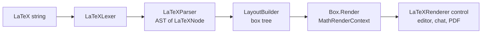

Mnemo renders math with its own engine. It is not MathJax, KaTeX, or a web view: a hand-written lexer and parser produce an AST, a layout pass turns the AST into a tree of measured boxes, and the boxes draw themselves onto an Avalonia drawing context. The engine exists so equations render offline, instantly, inside native controls, and in PDF export, with one code path for all of them.

## Pipeline

The split across projects follows the dependency rule: lexer, parser, and the symbol table are pure and live in `Mnemo.Infrastructure/Services/LaTeX/`; layout and rendering need font measurement and Avalonia types, so they live in `Mnemo.UI/Services/LaTeX/`. `LaTeXEngine` (`Mnemo.UI/Services/LaTeXEngine.cs`, implementing `ILaTeXEngine` from Core) orchestrates the stages and owns the caches.

## Parsing

`LaTeXParser` produces these node types (`Mnemo.Infrastructure/Services/LaTeX/Parser/Nodes/`): `TextNode`, `SymbolNode`, `FractionNode`, `ScriptNode`, `GroupNode`, `SqrtNode`, `DelimiterNode`, `SpaceNode`, `TextModeNode`, `MathbbNode`, `MathbfNode`, and `MatrixNode`.

Recognized constructs:

| Construct | Handling |
| :--- | :--- |
| `\frac{a}{b}` | `FractionNode` |
| `\sqrt{x}`, `\sqrt[n]{x}` | `SqrtNode` |
| `_` and `^` | `ScriptNode`, combined sub plus super supported |
| `\left ... \right` | `DelimiterNode` with scaled delimiters |
| `\begin{matrix}` family (`matrix`, `pmatrix`, `bmatrix`, `vmatrix`, `Vmatrix`) | `MatrixNode`; `\\` breaks rows, `&` separates columns |
| `\text{...}` | text mode |
| `\mathbb{...}`, `\mathbf{...}` | mapped to Unicode math alphanumeric symbols |
| `\quad`, `\qquad` | fixed horizontal space |
| `\displaystyle`, `\textstyle` | accepted, currently no-ops |
| any other `\command` | looked up in the symbol registry |

`SymbolRegistry` (`.../Symbols/SymbolRegistry.cs`) maps roughly 200 commands to Unicode: Greek letters, operators, relations, arrows, set and logic symbols, delimiters, and miscellany. An unknown command does not fail the parse; it falls through to a `SymbolNode` that renders the command name as literal text. Parse errors are collected into a list and the parser keeps going, so partial input still renders.

Other `\begin{...}` environments parse but get no special layout; their content renders inline. `align`, colors, and arbitrary font sizing are not supported.

## Layout

`LayoutBuilder` (`Mnemo.UI/Services/LaTeX/Layout/`) converts the AST into a box tree: `HBox`, `VBox`, `CharBox`, `FractionBox`, `ScriptBox`, `SqrtBox`, `MatrixBox`, `SpaceBox`, `RuleBox`, and `ScaledDelimiterBox`. Each box knows its width, height, and baseline. `FontMetrics` (`.../Metrics/FontMetrics.cs`) measures characters through Avalonia and caches measurements; spacing rules for fractions, scripts, and delimiters live there too. Layout uses the app's math font resource (`MathFontFamily`), not full OpenType math tables, which is the main fidelity limitation versus a TeX engine.

## Rendering

Boxes draw through `IMathRenderContext`, implemented by `MathRenderContext` (`Mnemo.UI/Services/LaTeX/Rendering/`) over Avalonia's `DrawingContext`. `LaTeXRenderer` (`Mnemo.UI/Controls/LaTeXRenderer.cs`) is the reusable control that hosts a rendered equation; it appears in equation blocks, chat markdown, and anywhere else math shows up. PDF export rasterizes through the same engine.

## Caching

Every stage caches, because equations re-render constantly while typing:

| Cache | Key | Capacity |
| :--- | :--- | :--- |
| Parse results in `LaTeXEngine` | LaTeX string | 500 |
| Layout trees in `LaTeXEngine` | string plus font size | 1000 |
| Glyph `FormattedText` | char, size, color | 500 |
| Font measurements in `FontMetrics` | char, size | unbounded concurrent |
| Inline equation boxes | string plus font size | per editor, via `InlineEquationController` |

`LaTeXEngine.ClearCache()` flushes parse, layout, and metric caches; it runs when the math font or theme changes.

## Editor integration

Block equations (`BlockType.Equation`) store LaTeX in `EquationPayload` and render lazily when scrolled into view (`EquationBlockComponent`). Inline equations are `EquationSpan` values inside flow text: `InlineEquationController` builds and caches their boxes, `RichTextLayoutBuilder` reserves their width in the text layout, and `RichTextEditor.InlineEquations.cs` paints them over the text. Clicking either kind opens a small source editor; inline equations behave as a single atomic character for caret and selection purposes.

## Where the code lives

| Concern | Path |
| :--- | :--- |
| Lexer and parser | `Mnemo.Infrastructure/Services/LaTeX/Parser/` |
| Symbol table | `Mnemo.Infrastructure/Services/LaTeX/Symbols/SymbolRegistry.cs` |
| Engine facade | `Mnemo.UI/Services/LaTeXEngine.cs`, contract `Mnemo.Core/Services/ILateXEngine.cs` |
| Layout and boxes | `Mnemo.UI/Services/LaTeX/Layout/` |
| Rendering | `Mnemo.UI/Services/LaTeX/Rendering/`, `Mnemo.UI/Controls/LaTeXRenderer.cs` |
| Inline integration | `Mnemo.UI/Components/BlockEditor/RichText/InlineEquationController.cs` |
