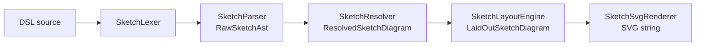

Sketch is Mnemo's diagram language: users write a small DSL and get a laid-out SVG. The entire compiler lives in `Mnemo.Core/Sketch/` and is pure: strings in, SVG plus diagnostics out, no UI or IO dependencies. That keeps it fully unit-testable (`SketchCompilerTests`) and reusable from the editor, PDF export, and anywhere else.

The user-facing syntax is documented in the [student sketch guide](/docs/students/notes/sketch). This page covers the implementation.

## Pipeline



`SketchCompiler` chains the stages. Every stage appends to a shared list of `SketchDiagnostic` values (error, warning, info, each with a source span) instead of throwing, so a broken line degrades that line, not the diagram. All stage outputs are immutable records defined in `SketchModels.cs`.

**Lexing.** `SketchLexer` tokenizes identifiers, strings, numbers, hex colors, arrows (`->`, `--`, `<->`), braces and brackets, and the keywords `sketch`, `class`, `group`, `edge`. Comments (`#`) become tokens too, which keeps spans accurate for diagnostics.

**Parsing.** `SketchParser` builds a flat statement list: meta blocks, node declarations (`[id] "Label" { props }`), edge declarations with optional labels and property blocks, class declarations, and group declarations whose bodies mix properties with bracket-ID member references.

**Resolving.** `SketchResolver` turns raw statements into a semantic graph. It creates implicit nodes for names that only appear in edges, merges class styles into node styles (`class: name` or `class: [a, b]`, later classes and direct properties win), and normalizes style properties: `fill`, `stroke`, `stroke-width`, `shape`, `style` (edge line style), and `tooltip`. Color values resolve to one of five kinds: named, hex, rgb, rgba, or theme token.

**Layout.** `SketchLayoutEngine` does rank-based DAG layout in the configured direction, the only layout currently implemented (`layout: dag`). Node sizes come from label measurement with text wrapping (`SketchTextWrapping`). Groups are laid out as containers around their members.

**Rendering.** `SketchSvgRenderer` emits the SVG: shapes (`rounded-rect` default, `rect`, `circle`, `diamond`; unknown shape names fall back to rounded-rect), edges with arrowheads and dash patterns, labels, group containers, and tooltips as SVG `<title>` elements. Named colors resolve through a built-in Tailwind-style palette (base names plus `-50` to `-900` scales); `theme(...)` tokens resolve against the active app theme so diagrams follow light and dark modes.

## Storage and integration

A sketch block stores its DSL source as plain text in the block's `Spans`; `SketchPayload` carries only display width and alignment. In markdown, sketches round-trip as ` ```sketch ` fences.

`SketchBlockComponent` (`Mnemo.UI/Components/BlockEditor/BlockComponents/`) shows the live SVG preview and opens the editing overlay. PDF export embeds the rendered SVG (`NotePdfSketchExportTests` covers this path).

A full design spec exists in the main repository at `docs/diagram-sketch/mnemo_sketch_architecture_spec.md`.

## Extending

- **New style property**: add it to `ResolvedSketchStyle`, parse it in `SketchResolver.ResolveStyle`, and consume it in the renderer.
- **New shape**: extend the switch in `SketchSvgRenderer` and, if the shape affects sizing, the measurement in `SketchLayoutEngine`.
- **New layout**: the `layout` meta property is parsed but only `dag` exists; a new engine would slot in at the layout stage.

## Where the code lives

| Concern | Path |
| :--- | :--- |
| All compiler stages | `Mnemo.Core/Sketch/SketchLexer.cs`, `SketchParser.cs`, `SketchResolver.cs`, `SketchLayoutEngine.cs`, `SketchSvgRenderer.cs`, `SketchCompiler.cs` |
| Models and diagnostics | `Mnemo.Core/Sketch/SketchModels.cs` |
| Block UI | `Mnemo.UI/Components/BlockEditor/BlockComponents/SketchBlockComponent` |
| Tests | `Mnemo.Infrastructure.Tests/SketchCompilerTests.cs`, `NotePdfSketchExportTests.cs` |
