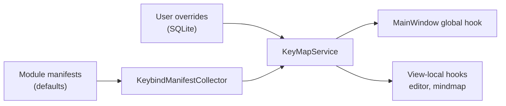

The keybind system separates what an action is from what keys trigger it. Modules declare actions with default bindings in manifests; users override them in the keybind manager; the runtime merges both and routes key events to whichever scope is active.

## Concepts

- **Action**: a stable string ID like `editor.bold` or `mindmap.recenter`, declared in a manifest with default bindings and a localized name.
- **Namespace**: the scope an action lives in. `global` actions work everywhere; `editor` and `mindmap` actions only fire when the matching surface is active. The navigation service tells the keybind system which route is active.
- **Chord and sequence**: a binding is either a single chord (`Primary+B`) or a multi-step sequence. Sequences have a 1.5 second timeout and cancel on Escape. No shipped default uses a sequence, but the engine supports them.
- **Primary modifier**: `Primary` resolves to Ctrl on Windows and Linux, Cmd on macOS. Manifests should use `Primary` instead of `Ctrl` so bindings localize across platforms. `KeybindGestureDisplayFormatter` renders the platform-correct symbols in UI.

## Flow

Manifests are registered during bootstrap via `IModule.RegisterKeybindManifest`. `KeyMapService` (`Mnemo.Infrastructure/Services/Keybinds/`) merges manifest defaults with user overrides from `SqliteKeybindRepository` (stored as JSON documents in the `keybind_overrides` table, including an enabled flag).

At runtime, `MainWindow` feeds key events to `ProcessGlobalKeyDown`, while editor and mind map views call `ProcessLocalKeyDown` with their namespace. Text input suppresses shortcuts through a capture-depth counter, and open overlays push onto a suppression stack so dialogs do not trigger workspace actions.

## Conflicts

`KeybindConflictAnalyzer` validates overrides: two actions in the same namespace cannot share a binding (error), and a local binding that shadows a global one produces a warning. The keybind manager UI (`KeybindManagerOverlayViewModel`) surfaces these before saving.

## Adding shortcuts

Declare the action in your module's keybind manifest with a default binding, then query or subscribe through `IKeyMap` in the view that handles it. Do not hard-code `KeyDown` checks in views; they bypass overrides, conflict analysis, and the manager UI. The default manifests worth reading are in `CoreUIModule` (global and editor), `MindmapModule`, and `FlashcardsModule`.

The full default binding list is in the [student shortcut reference](/docs/students/keyboard-shortcuts).

## Where the code lives

| Concern | Path |
| :--- | :--- |
| Models | `Mnemo.Core/Models/Keybinds/` |
| Gesture codec and display | `Mnemo.Core/Services/Keybinds/` |
| Runtime | `Mnemo.Infrastructure/Services/Keybinds/KeyMapService.cs` |
| Persistence | `Mnemo.Infrastructure/Services/Keybinds/SqliteKeybindRepository.cs` |
| Conflicts | `KeybindConflictAnalyzer` (same folder) |
| Manager UI | `Mnemo.UI/Components/Overlays/` keybind manager |
| Tests | `Mnemo.Infrastructure.Tests/` (five keybind test files) |
