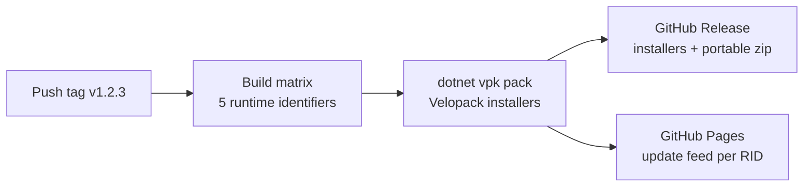

Releases are fully automated from a git tag. There is one workflow, `.github/workflows/release.yml`, and it only runs on tags matching `v*`.

## Pipeline

The version comes from the tag (`v1.2.3` becomes `1.2.3`). Each matrix leg publishes self-contained for its runtime identifier, then packs with the Velopack CLI (`vpk`, pinned in `.config/dotnet-tools.json`, channel `stable`, pack ID `Mnemo.Desktop`).

| RID | Runner | Artifact |
| :--- | :--- | :--- |
| `win-x64` | windows-latest | `Setup.exe` plus a portable zip |
| `linux-x64`, `linux-arm64` | ubuntu-latest | `.AppImage` |
| `osx-x64`, `osx-arm64` | macos-14 | `Setup.pkg`, icon generated from PNG during the build |

A post-publish MSBuild target strips native runtimes for other platforms (ONNX, Whisper, PvRecorder) to keep installers small. Release builds also drop debug symbols via `Directory.Build.props`.

Two follow-up jobs attach the installers to the GitHub Release and deploy the Velopack update feed (`.nupkg`, `RELEASES-*`, JSON manifests) to GitHub Pages under `feed/updates/stable/{rid}/`.

## In-app updates

`Program.cs` runs `VelopackApp.Build().Run()` before Avalonia starts, which is what lets an installer apply a pending update. At runtime, `VelopackUpdateService` checks the Pages feed for the current RID, and `UpdateOrchestrator` (`Mnemo.UI/Modules/Updates/`) handles the policy: a check on launch with a six-hour cooldown, toast or badge prompts, snooze keys, and apply-and-restart. The Windows portable build detects that it is not a Velopack install and falls back to pointing at GitHub Releases. `UpdateGatePolicyTests` covers the gating rules.

## Releasing, in practice

1. Make sure the version-worthy changes are merged and tests pass locally.
2. Tag the commit `vX.Y.Z` and push the tag.
3. Watch the workflow; when it finishes, verify the GitHub Release assets and that an installed build offers the update.

For local installer testing without touching the feed, use `scripts/pack-local.ps1`.
