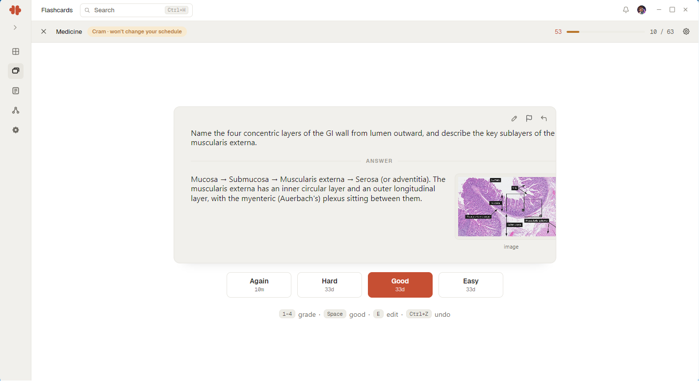

This guide covers the three ideas the flashcards module is built on: decks hold cards, sessions review them, and the scheduler decides when.

## Decks

A deck is a container for cards that belong together, usually one subject or one course. Prefer a few broad decks over many narrow ones; the scheduler works per card, so splitting a subject into twenty decks only adds bookkeeping.

## Writing cards that work

The quality of your reviews is set the moment you write the card:

- **One fact per card.** If the answer has three parts, make three cards.
- **Ask, do not describe.** A card should pose a question your brain can genuinely try to answer before the reveal.
- **Write in your own words.** Copied sentences test recognition; your own phrasing tests recall.

## The review loop

A session shows you each due card, waits for you to recall the answer, then asks how it went. That self-grade drives the schedule: hard cards return quickly, easy ones stretch out over days, then weeks, then months.

Missing a day is fine. Due cards wait, and the schedule adapts; it is a rhythm, not a debt collector.

## Related

- [Your first session](../../getting-started/your-first-session.md) if you have not run a review yet.
- [Notes first steps](../notes/first-steps.md) for capturing material before it becomes cards.
