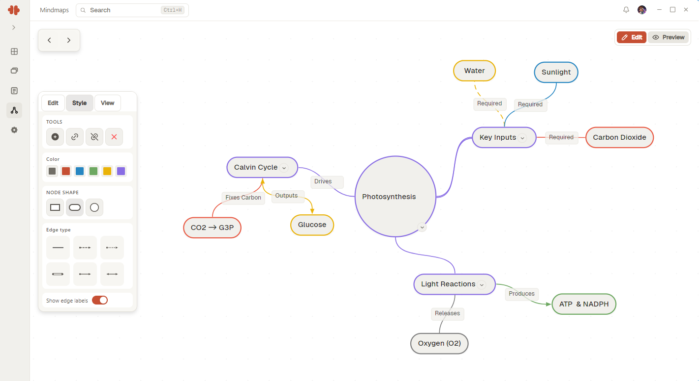

A mindmap starts with one node and grows outward. This guide builds a small map and covers the editing moves you will use constantly.

## Plant the center

Create a new map and name the central node after the subject, as one word or a short phrase. Everything else will hang off it, so keep it broad: "Photosynthesis", not "Photosynthesis chapter 4.2".

## Grow branches, not lists

Add a node for each major idea and connect it to the center. The value of a map over an outline shows up when you start cross-linking: when two branches touch the same concept, connect them. Those cross-links are the map earning its keep; a map without them is just an outline with extra steps.

## Keep maps small enough to see

A map you can take in at a glance is a map you can mentally replay later, and that replay is the study benefit. When a branch gets crowded, promote it to its own map.

## Related

- [Notes first steps](../notes/first-steps.md): notes capture the ideas, maps connect them.
