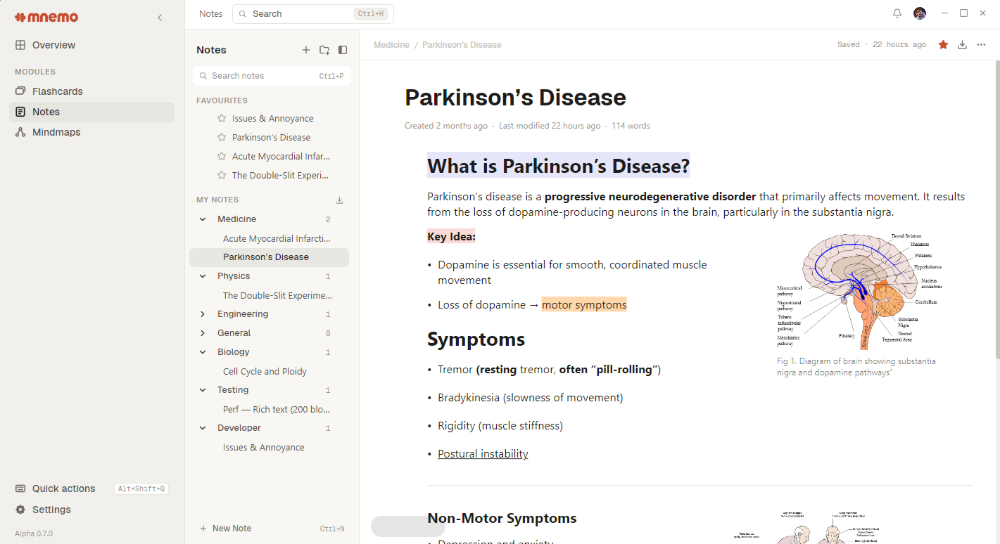

Notes in Mnemo are built for studying, not archiving: the editor stays out of the way so rewriting and structuring ideas stays fast.

## Start from structure

Create a note per topic, not per day. Headings inside a note become its skeleton; if a section outgrows the note, it is usually a sign it deserves a note of its own.

## Write to remember

Two habits make notes worth the time:

1. **Close the book first.** Write what you remember, then check. The gap between what you thought you knew and what was on the page is the most useful information you will get all day.
2. **Compress.** A note that shrinks with each pass is being learned. A note that only grows is a transcript.

## From notes to everything else

Notes sit in the same library as your decks and maps, so a concept you wrote up today can anchor the cards you write tomorrow. There is no forced pipeline; the modules just share one home.
